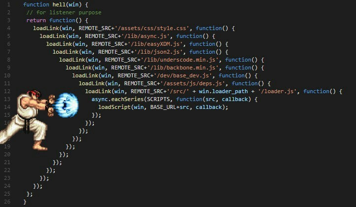

# CALLBACK  Nedir ?

--- 

- Asekron programlama da çalışırken işlemler için zaman atarız ve o süre bittikten sonra çalışır fakat bazı aksilikler çıkabilir. Aşağıda örnek vermek gerekirse.
- ###   Örnek 
```js
function getName () {
    setTimeout(() => {
        console.log("Ramadan");
    }, 1000); // 1 saniye
}
function getSurname () {
    setTimeout(() => {
        console.log("Sanar");
    }, 500) ;// 0.5 saniye
}
getName();
getSurname();
```
- Bu kodun çıktısı ` Sanar Ramadan` olacaktır fakat bu olay veri tabanında olsaydı ve veri tabanının ne kadar hızda isim veya soy adı verisini gönderdiğini bilmediğimiz için bu bize sıkıntı çıkartıyor. 
- Aslında bu sorunu çözmek için `CALLBACK Functions` ortaya çıkmıştır.
- Asekron programlamada 3 yöntemlerden bahsetmiştik aslında `CALLBACK ` en eski yöntemdir.
- Soru: Aklınızdan şu soru geçmiş olabilir neden eski yöntemi kullanıyoruz ?
- Cevap: Yeni yöntemleri öğrenmek için eski yöntemlerden bilgi sahibi olmalıyız :)
- `CALLBACK` ile asekron ile tasarladığımız kodu sekron hale getireceğiz fakat mantıklı çalışmasını sağlayacağız. Yukarıdaki yazdığımız kodlar 1 saniyede biterken artık 1.5 saniyede bitecek ama düzenli bir şekilde çalışacak.
- CALLBACK yapmamız için fonksiyona bir parametre atamak lazım bu parametrenin adı önemli değildir*. Ben `call` parametresi atayacam.
- Bir fonksiyonu bir fonksiyona parametre geçerek asekron yapıyı sekrona çeviririz.
```js
function getName (call) {
    setTimeout(() => {
        console.log("Ramadan"); // Sunucu tarafından geldiğini düşünün
        call();
    }, 1000); // 1 saniye
}
function getSurname () {
    setTimeout(() => {
        console.log("Sanar"); // Sunucu tarafından geldiğini düşünün
    }, 500); // 0.5 saniye
}

getName(getSurname);
```

- Neden böyle bir şey yaptık çünkü yukarıda şunu demiştim " Bir fonksiyonu bir fonksiyona parametre geçerek asekron yapıyı sekrona çeviririz." Bu yüzden `getName` fonksiyonunu çağırdım ve `call` diye parametre atadım aslında o parametre `getSurname` parametresini temsil etmekte. `Ramadan` adı çağrıldıktan sonra `call()` parametresini çağrıp `getSurname` fonksiyonunu tetikledik. 0.5 saniye sonra ekran `Sanar` soy adını yazdıracaktır.

- ### Alternatif Örnek
```js
function getName (call) {
    setTimeout(() => {
        let name = "Ramadan"; // Sunucu tarafından geldiğini düşünün
        call(name);
    }, 1000) // 1 saniye
}
function getSurname (name) {
    setTimeout(() => {
        let surName = "Sanar"; // Sunucu tarafından geldiğini düşünün
        console.log(name, surName);
    }, 500) // 0.5 saniye
}

getName(getSurname);

// Toplam harcanan süre 1.5 saniye
```

- ### Alternatif Örnek 2
```js
function getName (call) {
    setTimeout(() => {
        let name = "Ramadan"; // Sunucu tarafından geldiğini düşünün
    }, 1000) // 1 saniye
}
function getSurname (name, call) {
    setTimeout(() => {
        let surName = "Sanar"; // Sunucu tarafından geldiğini düşünün
        call(surname);
    }, 500) // 0.5 saniye
}

getName((name) => {
    getSurname(name, (surname) => {
        console.log(`${name} ${surname}`); // Çıktı: Ramadan Sanar
    });
});

// Toplam harcanan süre 1.5 saniye
```
- Alternatif 2 de iç içe eklemeye devam edersek [`Callback Hell`](https://www.javatpoint.com/callback-hell-in-javascript) dediğimiz olay oluyor. Bu olay yüzünden kod yazan adamın (yani siz veya herhangi bir geliştirici) kodu anlayamıyor. Aşağıdaki resme bakarsanız daha iyi anlarsınız. 
---
