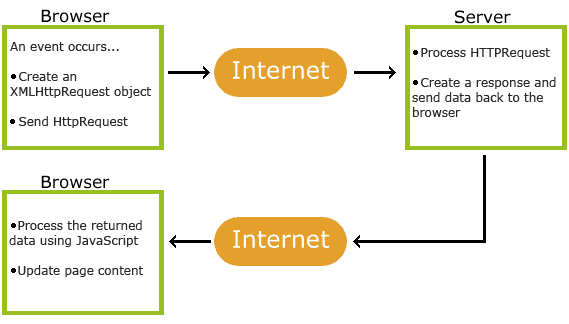

# AJAX

----

## Ajax Nedir?
**AJAX (Asynchronous JavaScript and XML)**, web sayfalarının arka planda sunucu ile iletişim kurarak sayfayı yeniden yüklemeden veri almasını veya göndermesini sağlayan bir tekniktir. AJAX, modern web uygulamalarında dinamik içerik güncellemeleri ve kullanıcı deneyimini geliştirmek için sıklıkla kullanılır.

## Ajax Nasıl Çalışır?
Aşağıdaki şema AJAX'ın nasıl çalıştığını göstermektedir:



1. **Tarayıcı Tarafında Olay:** Bir olay meydana gelir (örneğin bir düğmeye tıklama).
    - Bir `XMLHttpRequest` nesnesi oluşturulur.
    - HTTP isteği sunucuya gönderilir.
2. **Sunucu İşlemleri:** Sunucu HTTP isteğini işler ve bir yanıt oluşturur.
    - Yanıt tarayıcıya geri gönderilir.
3. **Tarayıcı Yanıt İşleme:** Tarayıcı, sunucudan dönen veriyi işler ve JavaScript kullanarak sayfa içeriğini günceller.

Bu döngü, kullanıcı deneyimini kesintisiz hale getirir çünkü sayfa yenilenmeden veri işlenir.

---

## AJAX'ın Kullanım Alanları
- **Canlı arama:** Arama sonuçlarının anında güncellenmesi.
- **Form doğrulama:** Form verilerini sunucuya göndermeden doğrulama.
- **Dinamik içerik yükleme:** Haber akışı gibi içeriklerin dinamik olarak güncellenmesi.
- **Haritalar:** Google Maps gibi uygulamalarda veri yükleme ve görüntüleme.
- **Bildirim sistemleri:** E-posta bildirimleri veya mesajlaşma uygulamaları.

---

## AJAX'ta Önemli Özellikler
`XMLHttpRequest` nesnesinin yaygın olarak kullanılan özellikleri ve durumları aşağıdaki tabloda açıklanmıştır:

| Özellik/Durum      | Açıklama                                                                 |
|--------------------|-------------------------------------------------------------------------|
| `onreadystatechange` | `XMLHttpRequest` nesnesinin durum değişikliklerini izlemek için kullanılan olay. |
| `readyState`       | İsteğin durumunu belirtir: 0: Başlatılmadı, 4: Tamamlandı.             |
| `status`           | HTTP durum kodunu döndürür. Detaylı hata kodları aşağıda verilmiştir.   |
| `statusText`       | HTTP durum kodunun metinsel açıklamasını döndürür.                     |

**`readyState` Durumları:**

| Değer | Durum                   | Açıklama                                  |
|-------|-------------------------|------------------------------------------|
| `0`   | UNSENT                 | İstek başlatılmadı.                       |
| `1`   | OPENED                 | İstek oluşturuldu.                        |
| `2`   | HEADERS_RECEIVED       | Başlık bilgileri alındı.                  |
| `3`   | LOADING                | Veri alınıyor.                            |
| `4`   | DONE                   | İstek tamamlandı.                         |

**`status` Kodları ve Anlamları:**

| Durum Kodu | Açıklama                        |
|------------|---------------------------------|
| `200`      | Başarılı (OK)                   |
| `201`      | Oluşturuldu (Created)           |
| `204`      | İçerik Yok (No Content)         |
| `400`      | Hatalı İstek (Bad Request)      |
| `401`      | Yetkisiz (Unauthorized)         |
| `403`      | Yasaklandı (Forbidden)          |
| `404`      | Bulunamadı (Not Found)          |
| `500`      | Sunucu Hatası (Internal Server Error) |
| `502`      | Geçersiz Ağ Geçidi (Bad Gateway)|
| `503`      | Hizmet Kullanılamıyor (Service Unavailable) |
| `504`      | Ağ Geçidi Zaman Aşımı (Gateway Timeout) |

---

## Geri Çağırma İşlevine Sahip Bir AJAX Örneği
Aşağıdaki örnek, bir dosyadan veri yüklemek ve sayfa içeriğini güncellemek için `XMLHttpRequest` nesnesini nasıl kullanabileceğimizi göstermektedir:

```html
<!DOCTYPE html>
<html lang="en">
<body>

<div id="demo">

    <h1>The XMLHttpRequest Object</h1>

    <button type="button"
            onclick="loadDoc('ajax_info.txt', myFunction)">Change Content
    </button>
</div>

<script>
    function loadDoc(url, cFunction) {
        let xhttp;
        xhttp = new XMLHttpRequest();
        xhttp.onreadystatechange = function () {
            if (this.readyState === 4 && this.status === 200) {
                cFunction(this);
            }
        };
        xhttp.open("GET", url, true);
        xhttp.send();
    }

    function myFunction(xhttp) {
        document.getElementById("demo").innerHTML =
                xhttp.responseText;
    }
</script>

</body>
</html>
```

### Bu Kodda Neler Yapılıyor?
1. **`xhttp.open("GET", url, true);`**
    - `"GET"`: Sunucudan veri almak için kullanılan HTTP metodu.
    - `url`: İstek yapılacak dosyanın adresi.
    - `true`: İsteğin asenkron olarak yapılmasını sağlar. Bu sayede, sayfa diğer işlemleri yapmaya devam edebilir.

2. **`onreadystatechange`:** İsteğin durumunu takip eder.
    - Eğer `readyState` 4 ve `status` 200 ise, sunucudan başarılı bir şekilde yanıt alınmış demektir.

3. **`cFunction(this);`**
    - Geri çağırma işlevi olarak belirtilen fonksiyon çalıştırılır. Bu örnekte `myFunction` işlevi kullanılmıştır.

---

## Daha Fazla Bilgi İçin
Daha ayrıntılı bilgi ve kaynaklar için [MDN AJAX Dokümantasyonu](https://developer.mozilla.org/en-US/docs/Web/Guide/AJAX) adresine göz atabilirsiniz.
