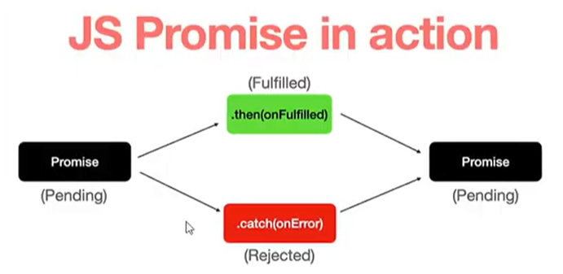

# Promise

---

- Promise aslında yazıcı olarak düşünülebilir ve 3 adımı vardır.
1. adım yazıcı gelen isteği bekler (pending modundadır)
2. Eğer ki işlem başarılı olduysa yazıcı size başarılı bir şekilde çıktı verir (bunun adı da fulfilled veya resolve olarak geçer.)
3. Eğer ki yazıcı hata verdiyse veya çıkarılan veri red edildiyse (bunun adı rejected olarak geçer.)

- Yukarıdaki örneği bilerek verdim daha iyi anlamanız için.

- Eğer ki resolve olan bir veriyi yakalamak istiyorsak `.then()` kullanılır.
- Reject olan bir veri için başta hata mesajı tanımlamak önemlideir ve hatalı işlemleri ise `.catch()` ile yakalarız.



- Anlamanız için örnek görsel koydum. 
- ### Promise kullanımı ile bir örnek
```js
function createPromise() {
    return new Promise( 
        (resolve, reject) =>
    {
        setTimeout(() => {
            if (check) {
                resolve ("Promise is successful.");
            } else {
                reject ("Promise is not successful.");
            }
        }, 300);
    });
}

createPromise()
    .then((response) =>
    {
        console.log(response);
    })
    .catch((error) =>
    {
        console.log(error);
    })
    .finally(()=> console.log('Deney tamamlandı'));
```
- Son olarak yukarda bahsetmediğim `finaly()` fonksiyonu var bu da her koşulda çalışır ve işlemin tamamlandığını belirtir bize.
- Promisler ES6 ile JavaScript dünyasına giriş yapmışlardır. 
- Callbacklerin alternatifi ve büyük projelerde genellikle kullanılırlar. 
- Asekron yapıları sekrona çevirmek için kullanılır.
