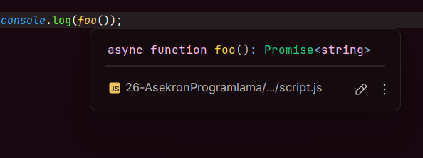

# Async-Await

---

## Kullanım Amacı

Async/Await, yazdığımız kodları daha anlaşılır ve yönetilebilir hale getirerek Promise zincirinden (Promise Hell) ve callback zincirinden kurtulmamızı sağlayan bir araçtır.

## Promise then Zinciri (Promise Hell)

Aşağıda, Promise Hell olarak bilinen karmaşık yapı gösterilmektedir:

```js
/*
.then(){
    .then(){
        .then(){
            .then(){
                .then(){
                }
            }
        }
    }
}
 */
```

### Gerçek Hayatta Proje Yaparken Promise Hell

Aşağıdaki HTML ve JS kodu, Promise zinciri ile bir işlem gerçekleştirmenin karmaşıklığını gösterir:

**Index.html**

```html
<html lang="en">
<head>
    <meta charset="UTF-8">
    <meta http-equiv="X-UA-Compatible" content="ie=edge">
    <title>Document</title>
</head>
<body>
<button id="button">Tıkla bana</button>
</body>
<script src="script.js"></script>
</html>
```

**script.js**

```js
document.querySelector("#button").addEventListener("click", () => {
   fetch("https://jsonplaceholder.typicode.com/posts/1").then((res) => res.json())
       .then((post) => {
          fetch(`https://jsonplaceholder.typicode.com/comments?postId=${post.id}`)
              .then((res) => res.json()).then((comments) => {
              console.log(comments);
          });
       });
});
```

Bu karmaşıklıktan kurtulmamızı sağlayacak olan Async/Await yapısını aşağıda inceleyebilirsiniz.

---

## Async/Await Nasıl Çalışır?

Async/Await, iki anahtar kelime kullanır: `async` ve `await`.

- **`async`**: Bir fonksiyonun asenkron olduğunu belirtir.
- **`await`**: Asenkron bir işlemin tamamlanmasını bekler ve işlemin sonucunu döndürür.

**Örnek:**

```js
"use strict";

async function foo () {
    return "Hello World!";
}

console.log(foo());
```



Yukarıdaki örnekte `console.log(foo());`, bir `Promise` döndürür. Bunun bilincinde olun ve IDE üzerinde "Promise" yapısında olduğunu görebilirsiniz.

---

## Gerçek Hayatta Proje Yaparken Async/Await Kullanımı

Aşağıdaki kod örneğinde, Async/Await ile Promise Hell yapısından kurtulabilirsiniz:

```js
document.querySelector("#button").addEventListener("click", async () => {
    const postResponse = await fetch("https://jsonplaceholder.typicode.com/posts/1");
    const postJson = await postResponse.json();
    
    // postId değerine göre ilgili yorumları içerir.
    const commentsResponse = await fetch(`https://jsonplaceholder.typicode.com/comments?postId=${postJson.id}`);
    
    const commentsJson = await commentsResponse.json();
    console.log(commentsJson); // Herhangi bir post id'sine göre yazılan yorumları konsol üzerinde yazdırır.
});
```

Gördüğünüz gibi kod daha anlaşılır ve kısa hale geldi.

- `await` sadece asenkron problemi yaşanan yerlerde kullanılmalıdır.
- JSON dönüştürme işlemi gibi senkronize edilmesi gereken durumlarda da kullanılabilir.
- İşlem bitmeden JSON dönüştürmesi yapılmazsa, "Asenkron Problemi" yaşanabilir.

---

## Daha Kısa Async/Await Kullanımı

Kodun daha kısa ve anlaşılabilir bir versiyonu da şu şekildedir:

```js
document.querySelector("#button").addEventListener("click", async () => {
    const post = await (await fetch("https://jsonplaceholder.typicode.com/posts/1")).json();
    
    // postId değerine göre ilgili yorumları içerir.
    const commentsJson = await (await fetch(`https://jsonplaceholder.typicode.com/comments?postId=${post.id}`)).json();
    console.log(commentsJson); // Herhangi bir post id'sine göre yazılan yorumları konsol üzerinde yazdırır.
});
```

### Düzenlemeler:

- `await fetch` kısmı parantez içine alınmıştır.
- İlk `await`, fetch işlemini tamamladıktan sonra yanıtı döndürür.
- Parantez dışına `await` koymazsanız, yine Asenkron Problemi ile karşılaşırsınız.

---